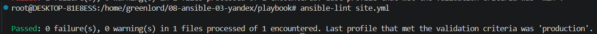
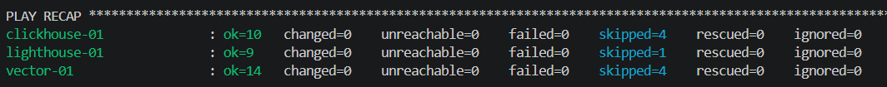
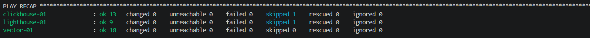

# Домашнее задание к занятию 3 «Использование Ansible»

## Подготовка к выполнению

1. Подготовьте в Yandex Cloud три хоста: для `clickhouse`, для `vector` и для `lighthouse`.
2. Репозиторий LightHouse находится [по ссылке](https://github.com/VKCOM/lighthouse).

## Основная часть

1. Допишите playbook: нужно сделать ещё один play, который устанавливает и настраивает LightHouse.
3. При создании tasks рекомендую использовать модули: `get_url`, `template`, `yum`, `apt`.
4. Tasks должны: скачать статику LightHouse, установить Nginx или любой другой веб-сервер, настроить его конфиг для открытия LightHouse, запустить веб-сервер.
5. Подготовьте свой inventory-файл `prod.yml`.
6. Запустите `ansible-lint site.yml` и исправьте ошибки, если они есть.

7. Попробуйте запустить playbook на этом окружении с флагом `--check`.

8. Запустите playbook на `prod.yml` окружении с флагом `--diff`. Убедитесь, что изменения на системе произведены.

9.  Повторно запустите playbook с флагом `--diff` и убедитесь, что playbook идемпотентен.
10. Подготовьте README.md-файл по своему playbook. В нём должно быть описано: что делает playbook, какие у него есть параметры и теги.

###  Описание
ClickHouse® — это высокопроизводительная, столбцовая система управления базами данных (СУБД) SQL для онлайн аналитической обработки (OLAP).

Vector - очередная перекладывалка логов, только в этот раз написан на blazingly fast языке программирования Rust.

LightHouse - это легкий интерфейс графического интерфейса для Clickhouse.

### Ansible Playbook
Ansible Playbook осуществляет установку данных компонентов на debian дистрибутивы Linux в Yandex Cloud через SSH.
Playbook разделены на три для каждой из задач:
 - playbook/clickhouse.yml
 - playbook/lighthouse.yml
 - playbook/vector.yml

### Необходимые действия

1. В файле playbook/group_vars/all/vars.yml укажите данные для подключения к удаленной виртуальной машине - ссылку на SHH ключ
2. В файлах playbook/group_vars/clickhouse/vars.yml и playbook/group_vars/vector/vars.yml опредлены переменные и их значения. Вы можете изменить значения, в том числе версии программного обеспечения.
3. В файл playbook/inventory/hosts.yml внесите ip адреса виртуальных машин и логин пользователя вашей виртуальной машины.

### Список файлов

Папка Playbook

    site.yml - для установки всего.
  
  Папка group_vars
  
    Папка all
      vars.yml - переменые all
    Папка clickhouse
      vars.yml - переменые clickhouse
    Папка lighthouse
      vars.yml - переменые lighthouse
    Папка vector
      vars.yml - переменые vector
      
  Папка inventory
  
    prod.yml - inventory
    
  Папка templates
  
    lighthouse.conf.j2 - шаблон веб сервера для запуска index.html  
    
    vector.service.j2 - шаблон запуска службы vector-server
    
    vector.toml - шаблон работы vector
    

11. Готовый playbook выложите в свой репозиторий, поставьте тег `08-ansible-03-yandex` на фиксирующий коммит, в ответ предоставьте ссылку на него.

